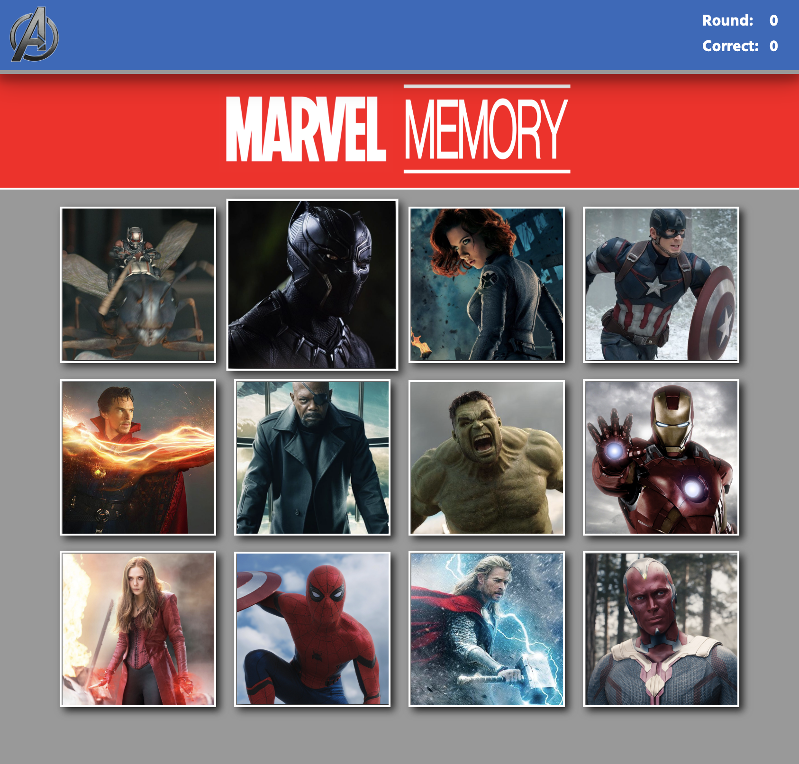

# Marvel Memory

## About

Memory game to help keep you sharp / nerd out.

## Getting Started

[Test it out](https://mahume.github.io/marvel-memory)
- 
1. Clicking on an image that has not been selected will increment the score.
2. After each click the images will shuffle themselves.
3. Continue to click on images that have not been selected yet.
4. When you have successfully clicked on all character images without a dublicate selections, the round will increment.
5. If you click on an image the has already been selected that round, you will lose your streak.

## Built With

- React
- Animate.css

## Author

- [Mike Hume](https://mahume.github.io/)
