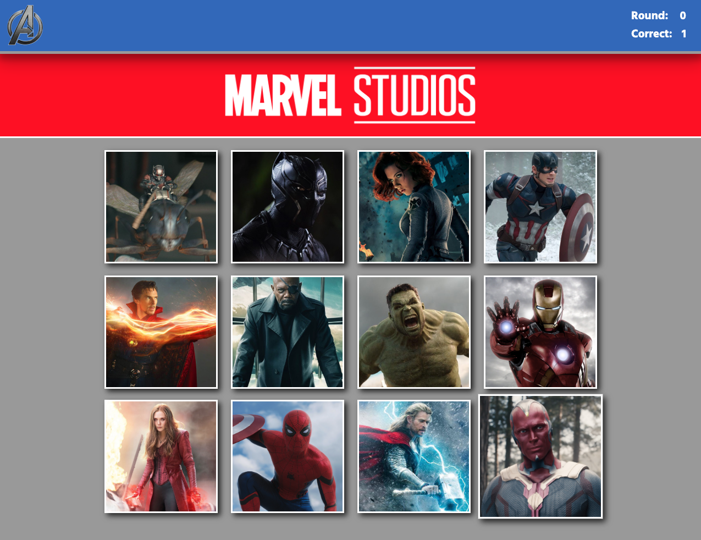

# Marvel Memory

## About

- Memory game to help keep you sharp
- Test app on [GitHub Pages](https://mahume.github.io/marvel-memory)

## Getting Started

- Click on an image and see the score increment.
- The character images will shuffle themselves.
- Continue to click on images that have not been clicked yet.
- When you successfully clicked on all character images the round will refresh.
- If you click on a previously selected image before the round was up you will lose your points

## Built With

- React
- Animate.css

## Author

- Mike Hume
